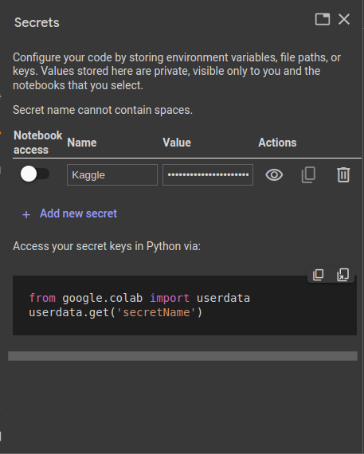

Presentation 1402.08.27
=======================

.. contents:: Table of contents

Introduction
------------

As we saw in **Deep learning with python book**, a simple layout
for a deep learning project looks like the code below:

.. code-block:: python

    from tensorflow.keras.datasets import mnist
    from tensorflow import keras
    from tensorflow.keras import layers

    # prepare data
    (train_images, train_labels), (test_images, test_labels) = mnist.load_data()

    train_images = train_images.reshape((60000, 28 * 28))
    train_images = train_images.astype("float32") / 255
    test_images = test_images.reshape((10000, 28 * 28))
    test_images = test_images.astype("float32") / 255

    # define our model
    model = keras.Sequential([
        layers.Dense(512, activation="relu"),
        layers.Dense(10, activation="softmax")
    ])

    model.compile(optimizer="rmsprop",
                loss="sparse_categorical_crossentropy",
                metrics=["accuracy"])

    # train our model
    model.fit(train_images, train_labels, epochs=5, batch_size=128)

    # test our model
    test_loss, test_acc = model.evaluate(test_images, test_labels)

.. note::

    source: `Deep learning with python chapter 2 <https://github.com/fchollet/deep-learning-with-python-notebooks/blob/master/chapter02_mathematical-building-blocks.ipynb>`_

In this presentation, I try to show you how to:

* Load a notebook from `github <https://github.com/>`_ directly to
  `google colab <https://colab.research.google.com/>`_
* Get data from `Kaggle <https://www.kaggle.com/>`_
* Transfer learning

Load notebooks from github to colab
-----------------------------------

To load a notebook from `github <https://github.com/>`_ 
directly to `google colab <https://colab.research.google.com/>`_,
first we should press ``Ctrl+O`` (open notebook).
Then in the github tab, we can copy the address of the repository
that contains the notebooks that we want to load. After that, 
a list of notebooks will show up and we can select the one that we
wanted. One example is provided below:

.. image:: ../figures/github_colab.png

In this presentation, I'm using the codes provided in
https://github.com/LiterallyTheOne/deep_learning_4021
repository.

Load data from Kaggle to google colab
-------------------------------------

Sign up to Kaggle
^^^^^^^^^^^^^^^^^

To load data from
`Kaggle <https://www.kaggle.com/>`_
to
`google colab <https://colab.research.google.com/>`_,
first we should have an account in kaggle.
To do so we can go to https://www.kaggle.com, Then
select the **register** button on top right of the window.
After that, we can use our **gmail** to register to kaggle.

Kaggle api token
^^^^^^^^^^^^^^^^

After we registered successfully, we should get our
**api token**. To get that token, we should go to
`settings <https://www.kaggle.com/settings>`_ 
Then in api section, click on **create new token**.
This would give you a **json**
file containing your **username** and **key**. Something like this:

.. code-block:: json

    {"username":"your_username","key":"your_key"}

Create a new secret in google colab
^^^^^^^^^^^^^^^^^^^^^^^^^^^^^^^^^^^^^

First, We should open up google colab. Then in the left bar
there is a button that looks like a **key**, we should click on it.
After that a side bar will pop up that we sould select 
**Add new secret**. For the **Name**, choose ``Kaggle`` and for the
**Value** copy all the content of the **json** file that you took from 
the previous section. After doing that, you should have something like this:

Use kaggle CLI to download data
^^^^^^^^^^^^^^^^^^^^^^^^^^^^^^^

To be able to use Kaggle's api, we need to copy our **api token**
that we already put it in the **google colab secrets** to
``/root/.kaggle/kaggle.json``. To do so, we use the code below:

.. code-block:: python

    # imports
    from pathlib import Path
    from google.colab import userdata

    kaggle_target_path = Path('/root/.kaggle/kaggle.json')

    # make parent directory
    kaggle_target_path.parent.mkdir(exist_ok=True, parents=True)

    # write the content of our secret to that file
    with open(kaggle_target_path,'w') as f:
        f.write(userdata.get('Kaggle'))

After successfully writing our **Kaggle's api token** to
the target file, we are ready to use **Kaggle's api**. 
For example to download a dataset we can use the code below:

.. code-block:: 

    ! kaggle datasets download -d marquis03/fruits-100

.. note::

    more information in https://github.com/Kaggle/kaggle-api

Transfer learning
-----------------

**Transfer learning** is a technic that we are using a pretrained
model, on a new dataset with different purpose.

.. note::

    `transfer learning tensorflow <https://www.tensorflow.org/tutorials/images/transfer_learning>`_
    `transfer learning keras <https://keras.io/guides/transfer_learning/>`_

Train stage
-----------

Open the notebook below in colab:

https://github.com/LiterallyTheOne/deep_learning_4021/blob/master/presentation_1402_08_27/train_1402_08_27.ipynb

Test stage
-----------

Open the notebook below in colab:

https://github.com/LiterallyTheOne/deep_learning_4021/blob/master/presentation_1402_08_27/test_1402_08_27.ipynb

