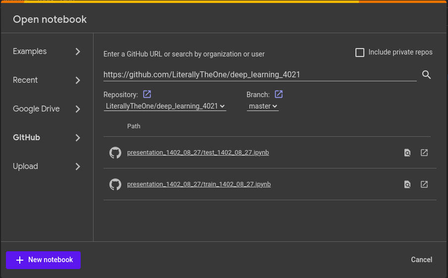

Presentation 1402.08.27
=======================

.. contents:: Table of contents

Introduction
------------

As we saw in **Deep learning with python book**, a simple layout
for a deep learning project looks likes the code below:

.. code-block:: python

    from tensorflow.keras.datasets import mnist
    from tensorflow import keras
    from tensorflow.keras import layers

    # prepare data
    (train_images, train_labels), (test_images, test_labels) = mnist.load_data()

    train_images = train_images.reshape((60000, 28 * 28))
    train_images = train_images.astype("float32") / 255
    test_images = test_images.reshape((10000, 28 * 28))
    test_images = test_images.astype("float32") / 255

    # define our model
    model = keras.Sequential([
        layers.Dense(512, activation="relu"),
        layers.Dense(10, activation="softmax")
    ])

    model.compile(optimizer="rmsprop",
                loss="sparse_categorical_crossentropy",
                metrics=["accuracy"])

    # train our model
    model.fit(train_images, train_labels, epochs=5, batch_size=128)

    # test our model
    test_loss, test_acc = model.evaluate(test_images, test_labels)

.. note::

    source: `Deep learning with python chapter 2 <https://github.com/fchollet/deep-learning-with-python-notebooks/blob/master/chapter02_mathematical-building-blocks.ipynb>`_

In this presentation, I try to show you how to:

* Load a notebook from `github <https://github.com/>`_ directly to
  `google colab <https://colab.research.google.com/>`_
* Get data from `Kaggle <https://www.kaggle.com/>`_
* Transfer learning

Load notebooks from github to colab
-----------------------------------

To load a notebook from `github <https://github.com/>`_ 
directly to `google colab <https://colab.research.google.com/>`_,
first we should press ``Ctrl+O`` (open notebook).
Then in the github tab, we can copy the address of the repository
that contains the notebooks that we want to load. After that, 
a list of notebooks will show up and we can select the one that we
wanted. One example is provided below:

In this presentation, I'm using the codes provided in
https://github.com/LiterallyTheOne/deep_learning_4021
repository.

Load data from Kaggle to google colab
-------------------------------------

pass

Kaggle api token
^^^^^^^^^^^^^^^^

pass

Colab secrets
^^^^^^^^^^^^^

pass

Copy secrets' contents to kaggle.json
^^^^^^^^^^^^^^^^^^^^^^^^^^^^^^^^^^^^^

pass

Use kaggle CLI to download data
^^^^^^^^^^^^^^^^^^^^^^^^^^^^^^^

pass

